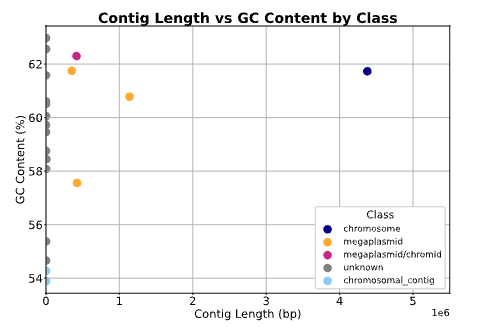

# ChroPlas
ChroPlas is a tool to classify contigs as chromosome, plasmid, chromids, and other elements, based on the length of contigs and key annotations. 

After bacterial genome assembly, it is crucial to classify the contigs into different categories such as chromosome, plasmid, chromids, phages, transposons, translocatable units, and other elements. While there are tools that classify contigs to plasmids and phages, no tool is available to classify chromosomes, megaplasmids, chromids, transposons, translocatable units, and other elements. 

ChroPlas makes use of length of contigs and key annotations and classifies contigs (see below for definitions). 

Note: the current version classify transposons, translocatable units, and other elements as "unknown". I plan to add support for these categories in future versions.

**Definition of classes** (based on [The Divided Bacterial Genome: Structure, Function, and Evolution](https://journals.asm.org/doi/10.1128/mmbr.00019-17))

<div align="center">
  
</div>

**chromosome:** contig >2 Mb and less than 10 Mb and/or carry chromosomal marker genes (ribosomal RNA)  
**chromosomal_contig:** contig less than 2 Mb and carry chromosomal marker genes (ribosomal RNA)  
**plasmid:** contig <0.35 Mb and carry plasmid marker genes (partitioning protein and/or conjugation genes)  
**megaplasmid:** contig >0.35 Mb and less than 2 Mb and carry plasmid marker genes (partitioning protein and/or conjugation genes)  
**chromid:** contig >0.35 Mb and less than 2 Mb and does not carry conjugation genes  
**unknown:** contigs that do not fit into any of the above categories  

The tool is tested on gff3 files generated by [Bakta](https://github.com/oschwengers/bakta), but it should work with any GFF file that contains the necessary gene annotations.

## Prerequisites
- Python 3.9

## Installation
To install and set up ChroPlas, follow these steps:

1. Clone the repository:
   ```bash
   git clone https://github.com/your-repo/ChroPlas.git
   ```
2. Navigate to the project directory:
   ```bash
   cd ChroPlas
   ```
3. Make the scripts executable:
   ```bash
   chmod +x installation.sh
   chmod +x ./ChroPlas.sh
   ```

4. Run the installation script:
   ```bash
   ./installation.sh
   ```

## Usage
```bash
Usage: ./ChroPlas.sh --help

### Options:
-i, --input-folder <input_folder>: Specify the input folder containing GFF files.
-o, --output-folder <output_folder>: Specify the output folder where results will be stored.
-h, --help: Display the help message and exit.

### Example:
./ChroPlas.sh -i test_data/ -o results/
```
---
### Results
After running the script, you will find the following files in the specified output folder:

$output-folder/stats/$gff_id.combined_stats.tsv  
$output-folder/$gff_id.results.pdf

**example output:** test_results/stats/Y2_17.combined_stats.tsv

| file_id | contig_id | features | length   | GC    | class                  | plasmid_partitioning_protein | Conjugal_transfer_protein | conjugative_transfer | plasmid_replication_protein | DNA-directed_RNA_polymerase_subunit_beta | recombinase_RecA | DNA_topoisomerase | ribosomal_RNA | chromosomal_replication_initiator_protein |
|---------|-----------|----------|----------|-------|------------------------|------------------------------|---------------------------|----------------------|-----------------------------|------------------------------------------|------------------|-------------------|---------------|------------------------------------------|
| Y2_17   | contig_1  | 4316     | 4377227  | 61.73 | chromosome             | 0                            | 0                         | 0                    | 0                           | 6                                        | 3                | 12                | 4             | 2                                        |
| Y2_17   | contig_2  | 345      | 352516   | 61.75 | megaplasmid            | 4                            | 0                         | 0                    | 2                           | 0                                        | 0                | 0                 | 0             | 0                                        |
| Y2_17   | contig_3  | 397      | 416676   | 62.3  | megaplasmid/chromid    | 4                            | 0                         | 0                    | 2                           | 0                                        | 0                | 3                 | 0             | 0                                        |
| Y2_17   | contig_4  | 396      | 422909   | 57.56 | megaplasmid            | 4                            | 3                         | 3                    | 2                           | 0                                        | 0                | 0                 | 0             | 0                                        |
| Y2_17   | contig_5  | 1067     | 1138694  | 60.78 | megaplasmid            | 8                            | 0                         | 0                    | 4                           | 0                                        | 0                | 0                 | 0             | 0                                        |

**example output:** test_results/Y2_17.results.pdf
<div align="center">
  
</div>

---
🧑‍💻 Author: Swapnil Doijad (swapnil.doijad@gmail.com)  
🙋 Support If you encounter bugs or have feature requests, please open an issue.